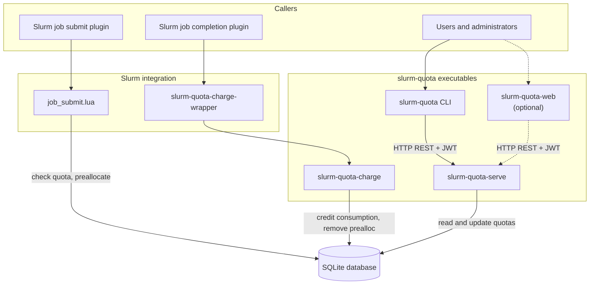

# slurm-quota

<!-- mdformat-toc start --slug=github --maxlevel=6 --minlevel=2 -->

- [Objective](#objective)
- [Features](#features)
- [Architecture](#architecture)
  - [Overview](#overview)
  - [Job submission plugin](#job-submission-plugin)
  - [Job charging](#job-charging)
  - [SQLite database](#sqlite-database)
  - [REST API](#rest-api)
    - [Authentication](#authentication)
    - [Roles](#roles)
    - [Routes](#routes)
    - [CLI client](#cli-client)
  - [Web application](#web-application)
  - [GPU load factors](#gpu-load-factors)
- [Installation](#installation)
  - [Controller node](#controller-node)
  - [Compute and login nodes](#compute-and-login-nodes)
  - [Web dashboard](#web-dashboard)
- [Usage](#usage)
  - [`slurm-quota` Command](#slurm-quota-command)
    - [REST API URL](#rest-api-url)
    - [JWT token](#jwt-token)
    - [Subcommands](#subcommands)
  - [`slurm-quota-serve` Command](#slurm-quota-serve-command)
  - [`slurm-quota-token` Command](#slurm-quota-token-command)
  - [`slurm-quota-web` Command](#slurm-quota-web-command)
  - [`slurm-quota-prune` Command](#slurm-quota-prune-command)
- [Upgrade](#upgrade)
- [Development](#development)
  - [Tests](#tests)
- [Acknowledgements](#acknowledgements)
- [License](#license)

<!-- mdformat-toc end -->

## Objective<a name="objective"></a>

The objective of this solution is to assign CPU and GPU minute quotas to users and accounts on Slurm clusters, and to
block Slurm job submissions and modifications when these quotas are reached.


The solution takes into account the time preallocated to jobs that are not yet completed. These jobs must be accounted
for to prevent users/accounts from submitting jobs in parallel that, when added together, could exceed the quota once
they are accounted for upon completion. By controlling the sum of "consumed + preallocated" at both the user and account
levels, we ensure that reserved but not yet used capacity is properly accounted for and that the system is not
over-committed.

## Features<a name="features"></a>

- CPU and GPU minute quotas per user and Slurm account
- Submission blocking when consumed + preallocated exceeds quota
- Default quotas applied automatically when a user or account is first created
- GPU load factors to weight billed GPU minutes by hardware type (e.g. count H100 usage at half rate)
- Native Slurm integration via `job_submit` and job completion plugins
- REST API with LDAP login and role-based authorization
- User CLI for statistics, quota management and role management
- Web dashboard with inline quota/consumption editing

## Architecture<a name="architecture"></a>

### Overview<a name="overview"></a>

The solution is built around a SQLite database. This database is used by 2 programs:

- `job_submit.lua`, a Lua script designed to be used as a Slurm submission plugin.
- `slurm-quota`, a Python application shipped as several executables for Slurm integration, administration, and user
  access.

The Python side provides these executables:

| Executable                   | Purpose                                                                                                                                                      |
| ---------------------------- | ------------------------------------------------------------------------------------------------------------------------------------------------------------ |
| `slurm-quota-serve`          | HTTP/JSON REST API on the controller; reads and updates quota data, enforces authentication and role-based authorization.                                    |
| `slurm-quota`                | CLI for users and administrators that acts as client of REST API to get statistics, manage quotas and roles.                                                 |
| `slurm-quota-charge`         | Credits actual CPU/GPU consumption when a job completes or is cancelled; removes the matching preallocation. Invoked by Slurm through job completion plugin. |
| `slurm-quota-web` (optional) | Web dashboard; same role as the CLI for viewing and editing data, implemented as a browser front-end to REST API.                                            |

Interactions between components is illustrated in this diagram:



At runtime, Slurm drives the quota lifecycle on the controller: `job_submit.lua` checks quotas and records
preallocations in the database at submit/modify time, then `slurm-quota-charge` reconciles consumption when jobs finish.
The `slurm-quota` CLI (and optional `slurm-quota-web` dashboard) go through HTTP REST API served by `slurm-quota-serve`,
which centralizes access control and keeps a single interface to the database for queries and administrative changes.

### Job submission plugin<a name="job-submission-plugin"></a>

When the Lua submission plugin is enabled in the Slurm configuration (`JobSubmitPlugins=lua`), the `job_submit.lua`
script is automatically called during each job submission or modification (`sbatch`, `srun`, `scontrol`, etc.) to
validate the request before it is accepted into the system. The script can thus apply custom rules (such as quota
control for example) and reject jobs that do not comply with the defined policies.

Slurm-quota provides a `job_submit.lua` script that calculates the requested CPU minutes from `num_tasks × time_limit`.
It also calculates the requested GPU minutes from the GPU resources specified in the job's TRES fields (`tres_per_job`,
`tres_per_task`, `tres_per_node`, `tres_per_socket`), taking into account the load factors configured by GPU type. It
then checks if a numeric quota is set in the database (`quota_cpu_minutes != -1` for CPU, `quota_gpu_minutes != -1` for
GPU). The plugin compares the calculated CPU and GPU minute value for the job to the available share, defined as the
quota minus the sum of "already consumed" and "already preallocated". This check is performed for both the user and the
account, for both CPU and GPU. If the request exceeds any of the available shares (CPU or GPU), the submission or
modification is refused, with an explicit message to the user.

When a job submission is accepted, the Lua script creates a corresponding preallocation in the `jobs_preallocations`
table and associates this preallocation with a generated unique UUID identifier, the Slurm `username`, and the Slurm
`account`. In case of an accepted job modification, the Lua script updates the preallocation assigned to the job in the
database.

The Lua script generates a UUID at submission time to uniquely identify jobs and to be able to track the preallocated
time until their completion. The job ID unfortunately cannot be used for this purpose because it is not yet available at
the time of the `job_submit` callback (Slurm assigns a job ID later only if the job is accepted by the `job_submit.lua`
script). The generated UUID identifier is stored in the job's `admin_comment` field, so it can be retrieved by the
solution to reassociate the preallocation with the job during other steps.

### Job charging<a name="job-charging"></a>

When the job completion plugin is enabled in the Slurm configuration (`JobCompType=script`), Slurm executes a configured
script on the controller every time a job completes or is cancelled. This hook allows external logic to run after jobs
leave the queue (for example to record resource usage or update accounting data).

Slurm-quota provides the `slurm-quota-charge-wrapper` script for this purpose
(`JobCompLoc=/etc/slurm/slurm-quota-charge-wrapper`). The wrapper invokes the `slurm-quota-charge` command. The wrapper
is used for 2 reasons:

- Slurm does not allow directly specifying arguments to the command executed by the _script_ completion plugin. The
  wrapper allows this limitation to be bypassed.
- Slurm systematically redirects JobComp script output to `/dev/null`. By using the wrapper as an intermediate layer, it
  is possible to redirect the output of the `slurm-quota-charge` command to a dedicated log file
  (`/var/log/slurm/charge/slurm-quota-charge.log`) to ensure that all processing information and any errors are
  preserved to trace operations.

Upon job completion, the `slurm-quota-charge` command retrieves the UUID from `admin_comment` and the allocated GPU
resources from `AllocTRES` (via `sacct`). It calculates the effective consumption in CPU minutes according to
`PROCS × (END − START) / 60` and in GPU minutes according to the allocated GPUs, their type, and the configured load
factors. It credits these consumptions to the user and to the account, and deletes the corresponding preallocation in
the database. This step ensures that the difference between "reserved" and "actually used" is correctly reconciled for
both dimensions (CPU and GPU).

Additionally, a logrotate configuration file is provided (`slurm-quota-charge.logrotate`) to prevent the log file fed by
the `slurm-quota-charge-wrapper` wrapper from growing too large over time.

### SQLite database<a name="sqlite-database"></a>

The SQLite database contains these tables:

- `users`: user names, consumed CPU and GPU minutes, and assigned quotas.
- `accounts`: Slurm account names, consumed CPU and GPU minutes, and assigned quotas.
- `jobs_preallocations`: CPU and GPU minutes preallocated to non-completed jobs, with `job_uuid`, `username`, and
  `account`.
- `gpu_factors`: load factors by GPU type for billed GPU minute calculation.
- `settings`: key/value configuration (default CPU and GPU quotas applied when a user or account is auto-created).
- `operators`: usernames granted the operator role.
- `managers`: usernames granted the manager role.
- `manager_accounts`: Slurm accounts assigned to each manager.

We record the amount of preallocated time per job rather than a global value per user to allow fine-grained updates
during modifications (increase or decrease of `time_limit`/`num_tasks`), targeted deletion of the preallocation upon
completion, and robust cleanup of orphans. A global value would hide the detail per job and significantly complicate
adjustments and cancellations, with an increased risk of inconsistencies.

The SQLite database file must have the system user `slurm` as owner, with mode `0644` to restrict modification
permission to the `slurm` user (used by `slurmctld` for the Lua script, the jobcomp script, and `slurm-quota-serve`) and
to administrators with the `root` account. Other users only have read-only access to the database. `slurm-quota-charge`
and `slurm-quota-serve` automatically create the database when it is missing (on first charge run or HTTP API service
start), setting the correct permissions on the file. SQLite WAL (Write-Ahead Logging) mode is enabled automatically to
reduce lock contention between concurrent writers.

### REST API<a name="rest-api"></a>

The `slurm-quota-serve` command starts a HTTP/JSON server designed to work with systemd "socket activation". It must run
as the `slurm` system user and creates the SQLite database on first start if it does not exist yet. A
`slurm-quota.socket` socket unit listens on TCP port 9911 and launches the `slurm-quota.service` service on demand upon
the first connection. The server can automatically stops after a configurable period of inactivity (10 minutes by
default).

#### Authentication<a name="authentication"></a>

Protected REST API routes require a Bearer JWT in the `Authorization` header provided by the client. Slurm-quota can
issue JWT tokens to clients with two authentication methods:

- **LDAP** — Users authenticate with their LDAP credentials.
- **JWT** — Administrators manually issue tokens offline with `slurm-quota-token`.

Authentication method is configured in `/etc/slurm-quota/serve.ini`. In `[authentication]` section, set `method=ldap` or
`method=jwt`.

In both cases, issued JWT tokens are signed with a key that is created automatically at `/var/lib/slurm-quota/jwt.key`
on first API start (override in `[jwt]` if needed).

#### Roles<a name="roles"></a>

REST API routes are protected by an authorization policy based on four roles:

- **user** — Can view only their own consumption stats (including Slurm accounts they belong to).
- **manager** — Can view statistics only for assigned Slurm accounts and users who belong to those accounts.
- **operator** — Can view all statistics and manage quotas, consumption, default quotas, and GPU factors.
- **admin** — Can view all statistics, manage quotas, consumption, default quotas, and GPU factors. Can grant or revoke
  operator and manager roles and assign accounts to managers (via `slurm-quota role` CLI or the web dashboard **Manage
  roles** page).

The **user** role is the default for any other authenticated user and is not persisted.

The **operator** and **manager** roles are granted or revoked by admins through the `slurm-quota role` CLI or the web
interface; assignments are stored in the SQLite database. For managers, admins also assign which Slurm accounts they may
view.

The **admin** users are listed in `[authorization] admins` in `serve.ini` at install time, they are not stored in the
database.

#### Routes<a name="routes"></a>

Following routes are served by REST API:

| Route                                                  | Purpose                                                          | Role                                                                           |
| ------------------------------------------------------ | ---------------------------------------------------------------- | ------------------------------------------------------------------------------ |
| `GET /health`                                          | Service health check                                             | none                                                                           |
| `POST /login`                                          | Authenticate with LDAP and obtain a JWT                          | none                                                                           |
| `GET /me`                                              | Return the current username and role                             | any authenticated user                                                         |
| `GET /stats`                                           | Return consumption, preallocation, and quota statistics          | **user** (own stats), **manager** (assigned accounts), **operator**, **admin** |
| `GET /roles`                                           | List all users with their roles                                  | **admin**                                                                      |
| `PUT /roles/operators/<username>`                      | Grant operator role                                              | **admin**                                                                      |
| `DELETE /roles/operators/<username>`                   | Revoke operator role                                             | **admin**                                                                      |
| `PUT /roles/managers/<username>`                       | Grant manager role                                               | **admin**                                                                      |
| `DELETE /roles/managers/<username>`                    | Revoke manager role                                              | **admin**                                                                      |
| `GET /roles/managers/<username>/accounts`              | List accounts assigned to a manager                              | **admin**                                                                      |
| `PUT /roles/managers/<username>/accounts/<account>`    | Assign an account to a manager                                   | **admin**                                                                      |
| `DELETE /roles/managers/<username>/accounts/<account>` | Remove an account from a manager                                 | **admin**                                                                      |
| `GET /quotas/defaults`                                 | Read default quotas applied to newly auto-created users/accounts | **operator**, **admin**                                                        |
| `PUT /quotas/defaults`                                 | Update default quotas for newly auto-created users/accounts      | **operator**, **admin**                                                        |
| `PUT /quotas/users/<username>/cpu`                     | Set CPU quota for a user                                         | **operator**, **admin**                                                        |
| `PUT /quotas/users/<username>/gpu`                     | Set GPU quota for a user                                         | **operator**, **admin**                                                        |
| `PUT /quotas/accounts/<account>/cpu`                   | Set CPU quota for an account                                     | **operator**, **admin**                                                        |
| `PUT /quotas/accounts/<account>/gpu`                   | Set GPU quota for an account                                     | **operator**, **admin**                                                        |
| `PATCH /consumption/user/<username>/cpu`               | Adjust consumed CPU minutes for a user                           | **operator**, **admin**                                                        |
| `PATCH /consumption/user/<username>/gpu`               | Adjust consumed GPU minutes for a user                           | **operator**, **admin**                                                        |
| `PATCH /consumption/account/<account>/cpu`             | Adjust consumed CPU minutes for an account                       | **operator**, **admin**                                                        |
| `PATCH /consumption/account/<account>/gpu`             | Adjust consumed GPU minutes for an account                       | **operator**, **admin**                                                        |
| `GET /factors/gpu`                                     | List GPU load factors                                            | **operator**, **admin**                                                        |
| `PUT /factors/gpu/<gpu_type>`                          | Set load factor for a GPU type                                   | **operator**, **admin**                                                        |

`GET /stats` returns a JSON object of the form `{ users: [...], accounts: [...] }`. Optional query parameters filter
responses: `username` limits users and accounts to that user's Slurm associations (e.g. `/stats?username=alice`), while
`account` returns only the requested account in the `accounts` array (e.g. `/stats?account=hpc`).

> [!NOTE]
> The `username` and `account` query parameters are mutually exclusive.

Quota routes accept `{"quota_minutes": <int>}` (`-1` means unlimited), with an optional single-line
`{"reason": "<string>"}`. Default quota routes accept a partial object with any of `user_cpu_minutes`,
`user_gpu_minutes`, `account_cpu_minutes`, `account_gpu_minutes` (`-1` means unlimited); defaults apply only to newly
auto-created users and accounts. Consumption routes accept `{"delta_minutes": <signed int>}` and return
`{"total_consumed_minutes": <int>}`, with an optional single-line `{"reason": "<string>"}`. GPU factor routes return
`{"default_factor": <float>, "factors": {<gpu_type>: <float>, ...}}` or accept `{"factor": <positive float>}`.

#### CLI client<a name="cli-client"></a>

The `slurm-quota` CLI calls the REST API. It offers the following commands:

| Command              | Purpose                                                                                           | Role                                                       |
| -------------------- | ------------------------------------------------------------------------------------------------- | ---------------------------------------------------------- |
| `login`              | Authenticate with LDAP and obtain a JWT                                                           | _all_                                                      |
| `token`              | Show current API token information; `--save` persists `SLURM_QUOTA_TOKEN` to the user config file | _all_                                                      |
| `stats`              | Display consumption, preallocation, and quota statistics                                          | **user** (own stats), **manager**, **operator**, **admin** |
| `role`               | Show or manage REST API user roles                                                                | show: any authenticated user; manage: **admin**            |
| `user-quota`         | Set CPU quota for a user                                                                          | **operator**, **admin**                                    |
| `user-gpu-quota`     | Set GPU quota for a user                                                                          | **operator**, **admin**                                    |
| `account-quota`      | Set CPU quota for an account                                                                      | **operator**, **admin**                                    |
| `account-gpu-quota`  | Set GPU quota for an account                                                                      | **operator**, **admin**                                    |
| `default-quotas`     | Show default quotas applied to newly auto-created users/accounts                                  | **operator**, **admin**                                    |
| `set-default-quotas` | Set default quotas for newly auto-created users/accounts                                          | **operator**, **admin**                                    |
| `adjust`             | Adjust consumed CPU or GPU time for a user or account                                             | **operator**, **admin**                                    |
| `gpu-factors`        | Show configured GPU load factors                                                                  | **operator**, **admin**                                    |
| `set-gpu-factor`     | Set load factor for a GPU type                                                                    | **operator**, **admin**                                    |

> [!NOTE]
> See the [`slurm-quota` command](#slurm-quota-command) section under [Usage](#usage) for authentication, examples, and
> options.

### Web application<a name="web-application"></a>

The optional `slurm-quota-web` application is a web dashboard that retrieves statistics from the HTTP API (`GET /stats`)
and renders them as HTML tables and quota usage bars.

When `authentication.method=ldap`, the dashboard presents a login page and stores each user's API JWT in a signed,
HttpOnly session cookie. Alternatively, set `SLURM_QUOTA_TOKEN` in the web server environment to authenticate API calls
with a service token (no per-user login).

Users with the **user** role see only their own stats; managers see stats for their assigned accounts; operators and
admins see all data. Operators and admins can edit quotas and adjust consumption inline on the dashboard. Admins can
open **Manage roles** to list all users with their role, grant or revoke operator and manager access, and assign
accounts to managers.

It can run standalone with Flask's built-in HTTP server for local testing, or be launched by a production-ready HTTP
server (for example Apache with mod_wsgi) as a WSGI application. See [Installation](#web-dashboard) for deployment
steps.

### GPU load factors<a name="gpu-load-factors"></a>

GPU load factors are multiplicative coefficients applied when converting GPU usage into billed GPU minutes. They let
administrators weight consumption by hardware type, reflecting different capacity or cost across GPU models. Factors are
stored in the `gpu_factors` table and used by `job_submit.lua` (preallocation at submit/modify time) and
`slurm-quota-charge` (consumption at job completion).

For example, assigning a factor of `0.5` to H100 GPUs counts 10 minutes of usage as 5 billed GPU minutes. The default
factor is `1.0` when no specific factor is configured for a GPU type. Operators and admins can view and update factors
with the `gpu-factors` and `set-gpu-factor` CLI commands.

## Installation<a name="installation"></a>

RPM packages are published for **Enterprise Linux 9** (RHEL 9, Rocky Linux 9, AlmaLinux 9, CentOS Stream 9, and similar)
in the [Rackslab packages](https://pkgs.rackslab.io/rpm/) repository. This guide uses LDAP authentication on the REST
API.

> [!NOTE]
> For JWT-only authentication, see [docs/authentication-jwt.md](docs/authentication-jwt.md). For installation from
> sources, see [docs/installation-manual.md](docs/installation-manual.md).

1. Install the Rackslab repository keyring:

```bash
sudo curl https://pkgs.rackslab.io/keyring.asc --output /etc/pki/rpm-gpg/RPM-GPG-KEY-Rackslab
```

2. Create `/etc/yum.repos.d/rackslab.repo` with this content:

```ini
[rackslab]
name=Rackslab
baseurl=https://pkgs.rackslab.io/rpm/el9/main/$basearch/
gpgcheck=1
gpgkey=file:///etc/pki/rpm-gpg/RPM-GPG-KEY-Rackslab
```

The following packages are available:

- `slurm-quota`: common files for all nodes (CLI, manpage, bash completion)
- `slurm-quota-controller`: controller-only files (`job_submit.lua`, wrapper, systemd units, logrotate, migration
  script)
- `slurm-quota-web`: optional web application with HTML dashboard

### Controller node<a name="controller-node"></a>

1. Install controller and common packages:

```bash
sudo dnf install slurm-quota slurm-quota-controller
```

2. Start and enable the socket-activated API service:

```bash
sudo systemctl enable --now slurm-quota.socket
```

3. Configure Slurm plugins in `slurm.conf`:

Edit the Slurm configuration to set up these parameters:

```ini
JobCompType=jobcomp/script
JobCompLoc=/etc/slurm/slurm-quota-charge-wrapper
JobSubmitPlugins=lua
AccountingStorageTRES=gres/gpu:<type1>,gres/gpu:<type2>
```

The `AccountingStorageTRES` parameter enables recording of complementary resource allocations (e.g., GPU, licenses) in
addition to generic resources (e.g., nodes, cores, memory) in the Slurm accounting database. It is necessary to enable
tracking of all GPU types in the cluster so that the `slurm-quota-charge` command can determine the GPUs allocated to
completed jobs and account for the time consumed on these GPUs.

4. Configure REST API authentication and HTTPS

Authentication is required for `GET /stats`. Edit `/etc/slurm-quota/serve.ini`. In production, enable native HTTPS on
the API so tokens and LDAP credentials are not sent in cleartext over the cluster network:

```ini
[authentication]
method=ldap

[ldap]
uri=ldap://ldap.example.org
user_base=ou=people,dc=example,dc=org
group_base=ou=groups,dc=example,dc=org

[authorization]
admins=
  admin-user

[tls]
enabled=true
cert=/etc/slurm-quota/tls/cert.pem
key=/etc/slurm-quota/tls/key.pem
```

Install the server certificate and private key where the `slurm` user can read them (for example under
`/etc/slurm-quota/tls/`). Restrict the key to group `slurm` with mode `0640`. If these paths are outside directories
already listed in `ReadOnlyPaths=` in `slurm-quota.service`, extend that unit accordingly.

> [!NOTE]
> As an alternative to native TLS in `serve.ini`, you can terminate HTTPS at a reverse proxy (for example nginx, Apache,
> or stunnel) in front of `slurm-quota-serve` and leave the API on plain HTTP on a trusted local address (for example
> `http://127.0.0.1:9911/`). Clients and the web dashboard then use the proxy's `https://` URL in `SLURM_QUOTA_URL`.

With `method=ldap`, the service exposes `POST /login` and issues JWT tokens after LDAP bind. The JWT signing key is
created automatically at `/var/lib/slurm-quota/jwt.key` on first start (override in `[jwt]` if needed). Additional LDAP
options (`bind_dn`, `restricted_groups`, TLS to the directory, and so on) are documented in
`/usr/share/slurm-quota/conf/serve.yml`.

List bootstrap admin usernames under `[authorization] admins`. These users can list all roles and grant or revoke
manager access.

Restart the API service after changing `serve.ini`:

```bash
sudo systemctl restart slurm-quota.socket
```

### Compute and login nodes<a name="compute-and-login-nodes"></a>

1. Install the common package:

```bash
sudo dnf install slurm-quota
```

2. Configure the controller API endpoint for all users in `/etc/profile.d/slurm-quota.sh`:

```bash
export SLURM_QUOTA_URL=https://controller:9911/
```

When the API certificate is signed by a private CA or an in-house CA that is not in the OS trust store, install that CA
on every client node and point the CLI at it with `SLURM_QUOTA_CA_CERT`:

```bash
export SLURM_QUOTA_URL=https://controller:9911/
export SLURM_QUOTA_CA_CERT=/etc/slurm-quota/tls/ca.pem
```

3. Obtain an API token:

```bash
slurm-quota login --save
```

### Web dashboard<a name="web-dashboard"></a>

1. Install the web dashboard package on the node running Apache:

```bash
sudo dnf install slurm-quota-web
```

2. Install Apache/mod_wsgi packages:

```bash
sudo dnf install httpd mod_wsgi httpd-tools
```

3. Create the session signing key file in `/etc/slurm-quota/web-session.key`:

```bash
sudo sh -c 'openssl rand -hex 32 > /etc/slurm-quota/web-session.key'
sudo chmod 0400 /etc/slurm-quota/web-session.key
sudo chown apache:apache /etc/slurm-quota/web-session.key
```

4. Configure the web dashboard environment:

Edit `/etc/default/slurm-quota-web`. Uncomment and set at least:

```bash
SLURM_QUOTA_URL=https://controller:9911/
SLURM_QUOTA_WEB_SESSION_KEY_FILE=/etc/slurm-quota/web-session.key
SLURM_QUOTA_WEB_SECURE_COOKIES=1
```

Use the same `https://` API URL as on compute and login nodes.

> [!NOTE]
> When the API certificate is signed by a private CA or an in-house CA that is not in the OS trust store, set
> `SLURM_QUOTA_CA_CERT` on the web server host so the dashboard can verify the backend certificate. Omit it when the API
> certificate is already trusted by the system CA bundle.
>
> `SLURM_QUOTA_WEB_SECURE_COOKIES=1` marks the dashboard session cookie with the `Secure` attribute so browsers send it
> only over HTTPS. Use this when the site is served behind TLS at Apache (recommended for LDAP login in production).
>
> Additional optional variables are documented as comments in `/etc/default/slurm-quota-web`.

5. Configure Apache virtual host with mod_wsgi:

```apache
<VirtualHost *:80>
    ServerName quota.example.org

    WSGIDaemonProcess slurm-quota-web processes=2 threads=5 display-name=%{GROUP}
    WSGIProcessGroup slurm-quota-web
    WSGIScriptAlias / /usr/share/slurm-quota/web/wsgi/slurm-quota-web.wsgi
    # If you mount in a subdir (example: /quota), use:
    # WSGIScriptAlias /quota /usr/share/slurm-quota/web/wsgi/slurm-quota-web.wsgi

    Alias /static/ /usr/share/slurm-quota/web/static/
    # Keep the static prefix aligned with WSGIScriptAlias:
    # - WSGIScriptAlias /      -> Alias /static/
    # - WSGIScriptAlias /quota -> Alias /quota/static/
    <Directory /usr/share/slurm-quota/web/static>
        Require all granted
    </Directory>

    <Directory /usr/share/slurm-quota/web/wsgi>
        <Files slurm-quota-web.wsgi>
            Require all granted
        </Files>
    </Directory>

    ErrorLog /var/log/httpd/slurm-quota-web-error.log
    CustomLog /var/log/httpd/slurm-quota-web-access.log combined
</VirtualHost>
```

6. Enable and reload Apache:

```bash
sudo systemctl enable --now httpd
sudo apachectl configtest
sudo systemctl reload httpd
```

> [!NOTE]
> Security recommendations:
>
> - Keep the backend API bound to cluster local networks when possible.
> - Restrict dashboard access to trusted networks when possible.
> - Serve the REST API over HTTPS (`[tls]` in `serve.ini`) and terminate HTTPS/TLS at Apache for the web dashboard.
> - Enable `SLURM_QUOTA_WEB_SECURE_COOKIES=1` in `/etc/default/slurm-quota-web`.

## Usage<a name="usage"></a>

This section summarizes common use of the Slurm-quota executables. Man pages are available for each command after
install (for example `man slurm-quota`, `man slurm-quota-serve`).

### `slurm-quota` Command<a name="slurm-quota-command"></a>

The CLI targets the REST API on the controller.

#### REST API URL<a name="rest-api-url"></a>

Set `SLURM_QUOTA_URL` to the API base URL. In production installations this is normally `https://controller:9911/` (see
[Installation](#compute-and-login-nodes)). On compute and login nodes, define it for all users (for example in
`/etc/profile.d/slurm-quota.sh`). For a one-off command:

```bash
SLURM_QUOTA_URL=https://controller:9911/ slurm-quota stats
```

When the API certificate is signed by a private CA, set `SLURM_QUOTA_CA_CERT` on the client host to the CA certificate
file:

```bash
export SLURM_QUOTA_URL=https://controller:9911/
export SLURM_QUOTA_CA_CERT=/etc/slurm-quota/tls/ca.pem
slurm-quota stats
```

The default URL when unset is `http://127.0.0.1:9911/` (plain HTTP on localhost, suitable for local testing on the
controller).

#### JWT token<a name="jwt-token"></a>

Most subcommands call the REST API with a Bearer JWT read from `$XDG_CONFIG_HOME/slurm-quota/token` (default
`~/.config/slurm-quota/token`). Set `SLURM_QUOTA_TOKEN` in the environment to override the saved token for a single
command.

With **LDAP** authentication, obtain and save a token once per user:

```bash
slurm-quota login --save
```

With **JWT** authentication, an administrator issues a token as root, then the user persists it:

```bash
export SLURM_QUOTA_TOKEN=$(sudo slurm-quota-token alice)
slurm-quota token --save
```

#### Subcommands<a name="subcommands"></a>

- `login`: Obtains a JWT token with LDAP authentication.

  ```bash
  slurm-quota login              # prompts for password, prints token to stdout
  slurm-quota login bob          # same for LDAP user bob
  slurm-quota login --save       # save token for automatic use by stats
  ```

- `token`: Shows metadata about the current API token (source, username, expiration). Use `--save` to persist the JWT
  from `SLURM_QUOTA_TOKEN` to the XDG config file (see JWT flow above).

  ```bash
  slurm-quota token              # show current token information
  slurm-quota token --save       # save SLURM_QUOTA_TOKEN for automatic use by stats
  ```

- `stats`: Displays consumed CPU times, preallocated CPU times (with the number of jobs considered), and quotas for
  users and accounts.

Examples:

```bash
slurm-quota stats                 # displays the current user and their accounts
slurm-quota stats alice           # details for user alice and their accounts
slurm-quota stats --user alice    # same as positional username
slurm-quota stats --account hpc   # only stats for account hpc
slurm-quota stats --all           # lists all users and all accounts
slurm-quota stats --hours         # same stats displayed in hours
```

> [!NOTE]
> `--account` is mutually exclusive with user selection (`--user` or positional username).

> [!NOTE]
> Color display of the status bar can be disabled by setting the `NO_COLOR` environment variable. The `--hours` option
> changes only the displayed unit in the `stats` output; stored values and API values remain in minutes.

- `role`: Show or manage REST API roles (requires a saved token or `SLURM_QUOTA_TOKEN`).

Examples:

```bash
slurm-quota role show                  # show current user and role (GET /me)
slurm-quota role list                  # list all users with roles (admin only)
slurm-quota role grant operator bob    # grant operator role (admin only)
slurm-quota role grant manager bob     # grant manager role (admin only)
slurm-quota role revoke operator bob   # revoke operator role (admin only)
slurm-quota role revoke manager bob    # revoke manager role (admin only)
slurm-quota role managers bob list     # list accounts assigned to a manager
slurm-quota role managers bob add hpc  # assign account to a manager
slurm-quota role managers bob remove hpc
```

- `user-quota` (requires operator or admin role): Sets a CPU quota for a user.

Examples:

```bash
slurm-quota user-quota alice 50000            # 50k CPU minutes
slurm-quota user-quota bob -1                 # unlimited
```

- `user-gpu-quota` (requires operator or admin role): Sets a GPU quota for a user.

Examples:

```bash
slurm-quota user-gpu-quota alice 10000        # 10k GPU minutes
slurm-quota user-gpu-quota bob -1             # unlimited GPU
```

- `account-quota` (requires operator or admin role): Sets a CPU quota for a Slurm account.

Examples:

```bash
slurm-quota account-quota projX 200000        # 200k CPU minutes for account projX
slurm-quota account-quota projY -1            # unlimited
```

- `account-gpu-quota` (requires operator or admin API role): Sets a GPU quota for a Slurm account.

Examples:

```bash
slurm-quota account-gpu-quota projX 50000   # 50k GPU minutes
slurm-quota account-gpu-quota projY -1      # unlimited GPU
```

- `adjust`: Adjusts consumed CPU/GPU time for one user or one account (operator or admin role required).

Examples:

```bash
slurm-quota adjust --user alice --cpu --minutes=+30     # add 30 consumed CPU minutes
slurm-quota adjust --user alice --gpu --minutes=-120    # subtract 120 consumed GPU minutes
slurm-quota adjust --account projX --cpu --hours=+2     # add 2 consumed CPU hours (120 minutes)
slurm-quota adjust --account projX --gpu --hours=-1     # subtract 1 consumed GPU hour (60 minutes)
```

> [!NOTE]
> - The delta must be explicitly signed (`+` or `-`), for example `+30` or `-30`.
> - Subtractions are clamped to zero: consumed time never becomes negative.

- `default-quotas` (operator or admin role required): Displays the default CPU/GPU quotas applied to newly auto-created
  users/accounts.

Example:

```bash
slurm-quota default-quotas
```

- `set-default-quotas` (operator or admin role required): Sets one or more default quotas applied when a user/account is
  auto-created by the submission plugin. Existing users/accounts are not modified.

Examples:

```bash
slurm-quota set-default-quotas --user-cpu 50000 --account-cpu 200000
slurm-quota set-default-quotas --user-gpu 10000 --account-gpu 50000
slurm-quota set-default-quotas --user-cpu -1 --user-gpu -1 --account-cpu -1 --account-gpu -1
```

- `gpu-factors`: Displays the currently configured GPU load factors (operator or admin role).

Example:

```bash
slurm-quota gpu-factors
```

- `set-gpu-factor`: Configures the load factor for a GPU type through the REST API (operator or admin role required).
  Billed GPU minutes are calculated as `number_GPU × time_minutes × factor`. The default factor is 1.0 if no factor is
  configured for a GPU type. Argument _factor_ must be a positive float (> 0).

Examples:

```bash
slurm-quota set-gpu-factor h100 0.5    # Factor 0.5 for h100 GPUs
slurm-quota set-gpu-factor h200 0.8    # Factor 0.8 for h200 GPUs
slurm-quota set-gpu-factor default 1.0  # Default factor (used if type is not specified)
```

### `slurm-quota-serve` Command<a name="slurm-quota-serve-command"></a>

Launches an HTTP REST API JSON server with `GET /health`, `GET /stats` (JWT required), and `POST /login` when
`authentication.method=ldap`. Designed to work with systemd socket activation.

Examples:

```bash
# Manual launch (testing; must run as slurm user)
sudo -u slurm slurm-quota-serve --host 127.0.0.1 --port 9911 --idle-timeout 600
sudo -u slurm slurm-quota-serve --host 127.0.0.1 --port 9911 --idle-timeout 0    # no idle timeout

# Via systemd (recommended)
sudo systemctl start slurm-quota.socket
curl http://127.0.0.1:9911/health
```

The service automatically stops after a period of inactivity (600 seconds, ie. 10 minutes by default). This can be
disabled with `--idle-timeout 0` argument. The `stats` command queries this HTTP service (URL configurable via the
`SLURM_QUOTA_URL` environment variable).

Dump resolved configuration (passwords masked) and exit:

```bash
slurm-quota-serve --dump-config
```

LDAP login when `authentication.method=ldap` with `curl`:

```bash
curl -s -X POST http://127.0.0.1:9911/login \
  -H 'Content-Type: application/json' \
  -d '{"username":"alice","password":"secret"}'
```

Query `/stats` with a token:

```bash
curl -H "Authorization: Bearer $TOKEN" http://127.0.0.1:9911/stats
```

> [!NOTE]
> For JWT-only authentication examples, see [docs/authentication-jwt.md](docs/authentication-jwt.md).

### `slurm-quota-token` Command<a name="slurm-quota-token-command"></a>

Issues JWT tokens for `authentication.method=jwt` (root only).

> [!NOTE]
> See [docs/authentication-jwt.md](docs/authentication-jwt.md) for configuration and usage examples.

### `slurm-quota-web` Command<a name="slurm-quota-web-command"></a>

Launches the web dashboard with built-in HTTP server.

This command is intended for local testing only; in production, run the web interface as a WSGI application behind a
production HTTP server (for example Apache with mod_wsgi). See [Web dashboard](#web-dashboard) under Installation.

Environment variables:

- `SLURM_QUOTA_URL`: base URL of the HTTP API (default `http://127.0.0.1:9911/`)
- `SLURM_QUOTA_CA_CERT`: path to a CA certificate file used to verify the API TLS certificate when `SLURM_QUOTA_URL`
  uses `https://` and the certificate is not trusted by the system store
- `SLURM_QUOTA_TOKEN`: service JWT for API calls; when set, the dashboard skips the browser login page; when not set,
  unauthenticated requests are redirected to the login form for LDAP authentication.
- `SLURM_QUOTA_WEB_SESSION_KEY_FILE`: path to a file containing the session signing key (required for LDAP
  authentication).
- `SLURM_QUOTA_WEB_SESSION_KEY`: session signing key passed directly (alternative to `SLURM_QUOTA_WEB_SESSION_KEY_FILE`)
- `SLURM_QUOTA_WEB_SECURE_COOKIES`: set to `1` to mark session cookies `Secure` (recommended behind HTTPS when using
  LDAP browser login)
- `SLURM_QUOTA_WEB_SESSION_DAYS`: browser session lifetime in days (default `7`)
- `SLURM_QUOTA_WEB_ASSETS_DIR`: custom templates/static directory
- `SLURM_QUOTA_WEB_HOST`, `SLURM_QUOTA_WEB_PORT`, `SLURM_QUOTA_WEB_DEBUG`: standalone server options
- `SLURM_QUOTA_WEB_ENV_FILE`: path to defaults file read by the WSGI script (default `/etc/default/slurm-quota-web`; not
  used by standalone CLI)

Examples:

```bash
SLURM_QUOTA_URL=http://127.0.0.1:9911/ slurm-quota-web
SLURM_QUOTA_WEB_HOST=0.0.0.0 SLURM_QUOTA_WEB_PORT=8080 SLURM_QUOTA_URL=http://controller:9911/ slurm-quota-web
```

> [!NOTE]
> For service-token mode (`SLURM_QUOTA_TOKEN`), see [docs/authentication-jwt.md](docs/authentication-jwt.md).

### `slurm-quota-prune` Command<a name="slurm-quota-prune-command"></a>

Cleans orphaned or unused data from the database (root only). Dedicated selectors:

- `--preallocs`: remove orphaned preallocations (jobs not present in Slurm queue)
- `--users`: remove users with both consumed CPU and consumed GPU at 0
- `--accounts`: remove accounts with both consumed CPU and consumed GPU at 0
- `--all`: prune all categories above (default behavior when no selector is provided)
- `--user <username>`: limit user pruning candidates to one username
- `--account <account>`: limit account pruning candidates to one account
- `--dry-run`: report how many preallocations/users/accounts would be removed, without deleting rows

Examples:

```bash
sudo slurm-quota-prune                  # default: same as --all
sudo slurm-quota-prune --preallocs      # prune only orphaned preallocations
sudo slurm-quota-prune --users          # prune only users with 0 consumed CPU/GPU
sudo slurm-quota-prune --users --user alice      # prune only this eligible user
sudo slurm-quota-prune --accounts       # prune only accounts with 0 consumed CPU/GPU
sudo slurm-quota-prune --accounts --account hpc  # prune only this eligible account
sudo slurm-quota-prune --dry-run        # preview removals without applying them
```

> [!NOTE]
> It is normally not necessary to execute this command under normal conditions. It may be useful in case of malfunction
> of the call to the `slurm-quota-charge` command by Slurm. Its execution is nevertheless safe, it can be executed if in
> doubt about the preallocated durations assigned to users.

## Upgrade<a name="upgrade"></a>

The following guides cover upgrades beyond routine RPM package updates:

- [Migrate from manual installation to RPM packages](docs/migration-manual-to-rpm.md)
- [Database migrations](docs/database-migrations.md)
- [Upgrade from version 2 to 3](docs/upgrade-v2-to-v3.md)

## Development<a name="development"></a>

### Tests<a name="tests"></a>

The repository includes unit tests under `tests/unit/` (one module per source module under `src/slurm_quota/`, with one
`TestCase` class per function) and functional CLI tests under `tests/functional/` (one module per command). They are
standard `unittest.TestCase` classes; the recommended runner is **pytest** (as in CI), with optional coverage reports
configured in `pyproject.toml`.

> [!NOTE]
> From the repository root, use a virtual environment on distributions that restrict system-wide `pip` (e.g. PEP 668):

```bash
python3 -m venv .venv
source .venv/bin/activate   # Windows: .venv\Scripts\activate
python -m pip install -U pip
python -m pip install ".[dev]"
```

Run the full suite (quiet mode, coverage for the loaded `slurm-quota` module, terminal + `coverage.xml`):

```bash
python -m pytest
```

## Acknowledgements<a name="acknowledgements"></a>

The development of this project was funded by [**ISDM-Meso**](https://isdm.umontpellier.fr/), part of the
[University of Montpellier](https://www.umontpellier.fr/en/).

<p align="center">
  <a href="https://isdm.umontpellier.fr/">
    
  </a>
  <a href="https://www.umontpellier.fr/en/">
    
  </a>
</p>

ISDM stands for *Institut des Sciences des Données de Montpellier*. ISDM-Meso is the ISDM mesocentre (mesocenter), i.e.
a shared mid-scale research computing facility providing HPC and data services to research teams, bridging local
institutional resources and national/international supercomputing centers. This tool was developed in that operational
context to support the administration of Slurm-based clusters.

## License<a name="license"></a>

This project is licensed under the GNU General Public License v2.0 or later (GPL-2.0-or-later). See [LICENSE](LICENSE)
for the full text.
