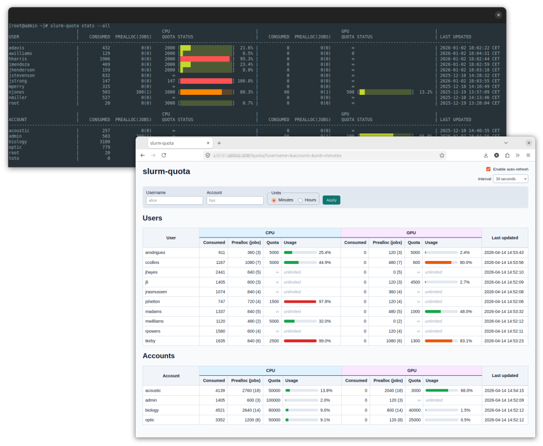

# slurm-quota

## Objective

The objective of this solution is to assign CPU and GPU minute quotas to users and accounts on Slurm clusters, and to block Slurm job submissions and modifications when these quotas are reached.



The solution takes into account the time preallocated to jobs that are not yet completed. These jobs must be accounted for to prevent users/accounts from submitting jobs in parallel that, when added together, could exceed the quota once they are accounted for upon completion. By controlling the sum of "consumed + preallocated" at both the user and account levels, we ensure that reserved but not yet used capacity is properly accounted for and that the system is not over-committed.

## Architecture & Operation

The solution is built around a SQLite database located at `/var/lib/state/slurm-quota/slurm-quota.db`.

This database is used by 2 programs:

- `job_submit.lua`, a Lua script designed to be used as a Slurm submission plugin.
- `slurm-quota`, a Python application with several subcommands intended to be executed by Slurm, administrators, and cluster users.

When the Lua submission plugin is enabled in the Slurm configuration, the `job_submit.lua` script is automatically called during each job submission or modification (`sbatch`, `srun`, `scontrol`, etc.) to validate the request before it is accepted into the system. The script can thus apply custom rules (such as quota control for example) and reject jobs that do not comply with the defined policies.

The provided `job_submit.lua` script calculates the requested CPU minutes from `num_tasks × time_limit`. It also calculates the requested GPU minutes from the GPU resources specified in the job's TRES fields (`tres_per_job`, `tres_per_task`, `tres_per_node`, `tres_per_socket`), taking into account the load factors configured by GPU type. It then checks if a numeric quota is set in the database (`quota_cpu_minutes != -1` for CPU, `quota_gpu_minutes != -1` for GPU). The plugin compares the calculated CPU and GPU minute value for the job to the available share, defined as the quota minus the sum of "already consumed" and "already preallocated". This check is performed for both the user and the account, for both CPU and GPU. If the request exceeds any of the available shares (CPU or GPU), the submission or modification is refused, with an explicit message to the user.

When a job submission is accepted, the Lua script creates a corresponding preallocation in the `jobs_preallocations` table and associates this preallocation with a generated unique UUID identifier, the Slurm `username`, and the Slurm `account`. In case of an accepted job modification, the Lua script updates the preallocation assigned to the job in the database.

The Lua script generates a UUID at submission time to uniquely identify jobs and to be able to track the preallocated time until their completion. The job ID unfortunately cannot be used for this purpose because it is not yet available at the time of the `job_submit` callback (Slurm assigns a job ID later only if the job is accepted by the `job_submit.lua` script). The generated UUID identifier is stored in the job's `admin_comment` field, so it can be retrieved by the solution to reassociate the preallocation with the job during other steps.

The `slurm-quota-charge-wrapper` wrapper script is designed to be executed by Slurm's job completion _script_ plugin (`JobCompType=script`). When this functionality is enabled, Slurm executes this script every time a job completes or is cancelled. This wrapper script actually executes the `slurm-quota charge` command. The wrapper is used for 2 reasons:

- Slurm does not allow directly specifying arguments to the command executed by the _script_ completion plugin. The wrapper allows this limitation to be bypassed.
- Slurm systematically redirects JobComp script output to `/dev/null`. By using the wrapper as an intermediate layer, it is possible to redirect the output of the `slurm-quota charge` command to a dedicated log file (`/var/log/slurm/charge/slurm-quota-charge.log`) to ensure that all processing information and any errors are preserved to trace operations.

Upon job completion, the `slurm-quota charge` command retrieves the UUID from `admin_comment` and the allocated GPU resources from `AllocTRES` (via `sacct`). It calculates the effective consumption in CPU minutes according to `PROCS × (END − START) / 60` and in GPU minutes according to the allocated GPUs, their type, and the configured load factors. It credits these consumptions to the user and to the account, and deletes the corresponding preallocation in the database. This step ensures that the difference between "reserved" and "actually used" is correctly reconciled for both dimensions (CPU and GPU).

In the SQLite database, there are 4 tables:

- `users`: It contains user names, consumed CPU and GPU minutes, and assigned quotas.
- `accounts`: It contains Slurm account names, consumed CPU and GPU minutes, and assigned quotas.
- `jobs_preallocations`: It contains CPU and GPU minutes preallocated to non-completed jobs, with `job_uuid`, `username`, and `account`.
- `gpu_factors`: It contains load factors by GPU type, allowing calculation of billed GPU minutes based on the GPU type used.

We record the amount of preallocated time per job rather than a global value per user to allow fine-grained updates during modifications (increase or decrease of `time_limit`/`num_tasks`), targeted deletion of the preallocation upon completion, and robust cleanup of orphans. A global value would hide the detail per job and significantly complicate adjustments and cancellations, with an increased risk of inconsistencies.

The SQLite database file must have the system user `slurm` as owner, with mode `0644` to restrict modification permission to the `slurm` user (used by `slurmctld` for the Lua script and the jobcomp script) and to administrators with the `root` account. Other users only have read-only access to the database. The `slurm-quota` script automatically creates the database with the `charge`, `user-quota`, and `account-quota` commands (intended for Slurm and administrators), setting the correct permissions on the file.

The commands `slurm-quota user-quota`, `slurm-quota account-quota`, `slurm-quota user-gpu-quota`, and `slurm-quota account-gpu-quota` respectively allow assigning CPU and GPU quotas to users and accounts.
The `slurm-quota adjust` command (restricted to root) allows manually adjusting consumed CPU/GPU time for one user or account with an explicitly signed delta.

Default quotas used when the solution auto-creates a user or account can be displayed with `slurm-quota default-quotas` and updated with `slurm-quota set-default-quotas`. These defaults are applied only to newly auto-created entries and do not modify existing users/accounts.

The solution allows setting GPU load factors. This is a multiplicative coefficient applied to the calculation of consumed GPU minutes based on the GPU type used. This factor allows adjusting, for each GPU type, the actual consumption weighting, taking into account the different value or computing power of the models (for example, assigning a factor of 0.5 to an h100 GPU amounts to counting 10 minutes of usage as only 5 minutes consumed). The default factor is 1.0 if no specific factor is configured for a given type. Thus, administrators can finely adapt GPU billing based on GPU models.

The `slurm-quota set-gpu-factor` command allows configuring load factors by GPU type (restricted to root). The `slurm-quota gpu-factors` command displays the currently configured GPU load factors.

The `slurm-quota serve` command starts a small HTTP/JSON server designed to work with systemd "socket activation". A `slurm-quota.socket` socket unit listens on TCP port 9911 and launches the `slurm-quota.service` service on demand upon the first connection. The server can automatically stops after a configurable period of inactivity (10 minutes by default). The API exposes a single `/stats` route that returns a JSON object of the form `{ users: [...], accounts: [...] }`. Optional query parameters can be used to filter responses: `username` filters users and limits accounts to this user's Slurm associations (e.g. `/stats?username=alice`), while `account` returns only the requested account stats in the `accounts` array (e.g. `/stats?account=hpc`).

The `slurm-quota stats` command consumes this HTTP/JSON API by default (URL configurable via the `SLURM_QUOTA_URL` environment variable, default `http://127.0.0.1:9911/`). It queries `/stats` and displays a readable table in the terminal. By specifying a user (`--user` or positional username), an account (`--account`), or the `--all` option, the command transmits the appropriate filters to the service. User and account selectors are mutually exclusive. If the service is not available or in case of connection failure to the server, execution fails with an error message.

Additionally, a logrotate configuration file is provided (`slurm-quota-charge.logrotate`) to prevent the log file fed by the `slurm-quota-charge-wrapper` wrapper from growing too large over time.

The `slurm-quota-web` application is a web dashboard that retrieves the same statistics from the HTTP API (`GET /stats`) and renders them as HTML tables and quota usage bars. It can run standalone with Flask built-in HTTP server for local testing, or be launched by a production-ready HTTP server (for example Apache with mod_wsgi) as a WSGI application.

## Installation

### RPM packages (recommended)

RPM packages are published for **Enterprise Linux 9** (RHEL 9, Rocky Linux 9, AlmaLinux 9, CentOS Stream 9, and similar) in the [Rackslab packages](https://pkgs.rackslab.io/rpm/) repository.

1) Install the Rackslab repository keyring:

```bash
sudo curl https://pkgs.rackslab.io/keyring.asc --output /etc/pki/rpm-gpg/RPM-GPG-KEY-Rackslab
```

2) Create `/etc/yum.repos.d/rackslab.repo` with this content:

```ini
[rackslab]
name=Rackslab
baseurl=https://pkgs.rackslab.io/rpm/el9/main/$basearch/
gpgcheck=1
gpgkey=file:///etc/pki/rpm-gpg/RPM-GPG-KEY-Rackslab
```

The following packages are available:

- `slurm-quota`: common files for all nodes (CLI, manpage, bash completion)
- `slurm-quota-controller`: controller-only files (`job_submit.lua`, wrapper, systemd units, logrotate, migration script)
- `slurm-quota-web`: optional web application with HTML dashboard

On the controller node:

1) Install controller and common packages:

```bash
sudo dnf install slurm-quota slurm-quota-controller
```

2) Start and enable the socket-activated API service:

```bash
sudo systemctl enable --now slurm-quota.socket
```

3) Configure Slurm plugins in `slurm.conf`:

Edit the Slurm configuration to set up these parameters:

```ini
JobCompType=jobcomp/script
JobCompLoc=/etc/slurm/slurm-quota-charge-wrapper
JobSubmitPlugins=lua
AccountingStorageTRES=gres/gpu:<type1>,gres/gpu:<type2>
```

The `AccountingStorageTRES` parameter enables recording of complementary resource allocations (e.g., GPU, licenses) in addition to generic resources (e.g., nodes, cores, memory) in the Slurm accounting database. It is necessary to enable tracking of all GPU types in the cluster so that the `slurm-quota charge` command can determine the GPUs allocated to completed jobs and account for the time consumed on these GPUs.

On compute/login nodes:

1) Install the common package:

```bash
sudo dnf install slurm-quota
```

2) Configure the controller API endpoint for all users in `/etc/profile.d/slurm-quota.sh`:

```bash
export SLURM_QUOTA_URL=http://controller:9911/
```

For the optional web dashboard:

1) Install the web dashboard package on the node running Apache:

```bash
sudo dnf install slurm-quota-web
```

2) Install Apache/mod_wsgi packages:

```bash
sudo dnf install httpd mod_wsgi httpd-tools
```

3) Configure Apache virtual host with mod_wsgi:

```apache
<VirtualHost *:80>
    ServerName quota.example.org

    # Optional: point web app to remote API endpoint
    SetEnv SLURM_QUOTA_URL http://127.0.0.1:9911/

    WSGIDaemonProcess slurm-quota-web processes=2 threads=5 display-name=%{GROUP}
    WSGIProcessGroup slurm-quota-web
    WSGIScriptAlias / /usr/libexec/slurm-quota/slurm-quota-web
    # If you mount in a subdir (example: /quota), use:
    # WSGIScriptAlias /quota /usr/libexec/slurm-quota/slurm-quota-web

    Alias /static/ /usr/share/slurm-quota-web/static/
    # Keep the static prefix aligned with WSGIScriptAlias:
    # - WSGIScriptAlias /      -> Alias /static/
    # - WSGIScriptAlias /quota -> Alias /quota/static/
    <Directory /usr/share/slurm-quota-web/static>
        Require all granted
    </Directory>

    <Directory /usr/libexec/slurm-quota>
        Require all granted
    </Directory>

    ErrorLog /var/log/httpd/slurm-quota-web-error.log
    CustomLog /var/log/httpd/slurm-quota-web-access.log combined
</VirtualHost>
```

4) Enable and reload Apache:

```bash
sudo systemctl enable --now httpd
sudo apachectl configtest
sudo systemctl reload httpd
```

5) Optional: enable HTTP Basic authentication with `htpasswd`:

```bash
sudo htpasswd -c /etc/httpd/conf.d/slurm-quota-web.htpasswd admin
```

Then add inside the same `<VirtualHost>`:

```apache
<Location />
    AuthType Basic
    AuthName "slurm-quota dashboard"
    AuthUserFile /etc/httpd/conf.d/slurm-quota-web.htpasswd
    Require valid-user
</Location>
```

Security recommendations:

- Keep the backend API bound to cluster local networks when possible.
- Restrict dashboard access with auth and/or trusted networks.
- Prefer HTTPS/TLS at Apache level.

### Manual installation (from sources)

#### Controller Node

Here is the procedure to follow to install the solution on the batch controller server:

1) Installation of Lua dependencies:

```bash
sudo dnf install lua-dbi lua-posix sqlite
```

2) Directories and permissions

```bash
# log directory for the wrapper
sudo mkdir -p /var/log/slurm/charge
sudo chown slurm: /var/log/slurm/charge

# data directory for the database
sudo mkdir -p /var/lib/state/slurm-quota
sudo chown slurm: /var/lib/state/slurm-quota
sudo chmod 0755 /var/lib/state/slurm-quota
```

3) Installation of the application

```bash
sudo python3 -m pip install .
```

Optional: install Bash completion for `slurm-quota`:

```bash
sudo cp slurm-quota.bash-completion /etc/bash_completion.d/slurm-quota
sudo chmod 0644 /etc/bash_completion.d/slurm-quota
```

4) Installation of the HTTP JSON service (optional)

The HTTP JSON service allows exposing statistics via a REST API to facilitate integration with other tools. It is designed to work with systemd socket activation.

```bash
# Installation of systemd files
sudo cp slurm-quota.socket /etc/systemd/system/
sudo cp slurm-quota.service /etc/systemd/system/
sudo chmod 0644 /etc/systemd/system/slurm-quota.socket
sudo chmod 0644 /etc/systemd/system/slurm-quota.service

# Reload systemd and enable the service
sudo systemctl daemon-reload
sudo systemctl enable --now slurm-quota.socket

# Service verification
sudo systemctl status slurm-quota.socket
curl http://127.0.0.1:9911/health
```

The service automatically stops after 10 minutes of inactivity (configurable via `--idle-timeout` in `slurm-quota.service`, with `0` meaning no idle timeout).

5) Installation of the wrapper script

```bash
sudo cp slurm-quota-charge-wrapper /etc/slurm/slurm-quota-charge-wrapper
sudo chmod 0755 /etc/slurm/slurm-quota-charge-wrapper
```

6) Slurm submission plugin (`job_submit.lua`)

```bash
sudo cp job_submit.lua /etc/slurm/job_submit.lua
sudo chmod 0644 /etc/slurm/job_submit.lua
```

7) Activation of Slurm plugins

Edit the Slurm configuration to set up these parameters:

```ini
JobCompType=jobcomp/script
JobCompLoc=/etc/slurm/slurm-quota-charge-wrapper
JobSubmitPlugins=lua
AccountingStorageTRES=gres/gpu:<type1>,gres/gpu:<type2>
```

The `AccountingStorageTRES` parameter enables recording of complementary resource allocations (e.g., GPU, licenses) in addition to generic resources (e.g., nodes, cores, memory) in the Slurm accounting database. It is necessary to enable tracking of all GPU types in the cluster so that the `slurm-quota charge` command can determine the GPUs allocated to completed jobs and account for the time consumed on these GPUs.

8) Logrotate configuration (recommended)

```bash
sudo cp slurm-quota-charge.logrotate /etc/logrotate.d/slurm-quota-charge
sudo chmod 0644 /etc/logrotate.d/slurm-quota-charge
```

It is recommended to back up the SQLite database file `/var/lib/state/slurm-quota/slurm-quota.db`. To do this, simply run this command regularly:

```bash
sudo sqlite3 /var/lib/state/slurm-quota/slurm-quota.db ".backup /var/lib/state/slurm-quota/slurm-quota-$(date +%Y-%m-%d).db"
```

#### Other Nodes

On the other nodes of the cluster, here are the steps to follow:

1) Installation of the application

```bash
sudo python3 -m pip install .
```

Optional: install Bash completion for `slurm-quota`:

```bash
sudo cp slurm-quota.bash-completion /etc/bash_completion.d/slurm-quota
sudo chmod 0644 /etc/bash_completion.d/slurm-quota
```

2) Set the `SLURM_QUOTA_URL` variable in the user environment

The `SLURM_QUOTA_URL` environment variable must point to the controller node to indicate the server to query to obtain quotas. To facilitate the use of the `slurm-quota stats` command, this variable must be automatically set in the user environment on all nodes. For example, it is possible to add the following line in the `/etc/profile.d/sh.local` file:

```bash
export SLURM_QUOTA_URL=http://controller:9911/
```

#### Web dashboard (optional)

1) Install dependencies:

```bash
sudo dnf install python3-flask python3-jinja2 httpd mod_wsgi httpd-tools
```

2) Install script and assets:

```bash
sudo install -Dm0755 slurm-quota-web /usr/local/bin/slurm-quota-web
sudo mkdir -p /usr/local/share/slurm-quota-web
sudo cp -r webapp/templates /usr/local/share/slurm-quota-web/
sudo cp -r webapp/static /usr/local/share/slurm-quota-web/
```

3) Configure the assets path for the app:

```bash
export SLURM_QUOTA_WEB_ASSETS_DIR=/usr/local/share/slurm-quota-web
```

4) Run standalone (HTTP built-in server, for testing only):

```bash
SLURM_QUOTA_URL=http://127.0.0.1:9911/ \
SLURM_QUOTA_WEB_ASSETS_DIR=/usr/local/share/slurm-quota-web \
/usr/local/bin/slurm-quota-web
```

5) Configure Apache with this manual installation:

```apache
<VirtualHost *:80>
    ServerName quota.example.org

    SetEnv SLURM_QUOTA_URL http://127.0.0.1:9911/
    SetEnv SLURM_QUOTA_WEB_ASSETS_DIR /usr/local/share/slurm-quota-web

    WSGIDaemonProcess slurm-quota-web processes=2 threads=5 display-name=%{GROUP}
    WSGIProcessGroup slurm-quota-web
    WSGIScriptAlias / /usr/local/bin/slurm-quota-web
    # If you mount in a subdir (example: /quota), use:
    # WSGIScriptAlias /quota /usr/local/bin/slurm-quota-web

    Alias /static/ /usr/local/share/slurm-quota-web/static/
    # Keep the static prefix aligned with WSGIScriptAlias:
    # - WSGIScriptAlias /      -> Alias /static/
    # - WSGIScriptAlias /quota -> Alias /quota/static/
    <Directory /usr/local/share/slurm-quota-web/static>
        Require all granted
    </Directory>

    <Directory /usr/local/bin>
        <Files slurm-quota-web>
            Require all granted
        </Files>
    </Directory>

    # Optional HTTP Basic authentication
    # AuthType Basic
    # AuthName "slurm-quota dashboard"
    # AuthUserFile /etc/httpd/conf.d/slurm-quota-web.htpasswd
    # Require valid-user

    ErrorLog /var/log/httpd/slurm-quota-web-error.log
    CustomLog /var/log/httpd/slurm-quota-web-access.log combined
</VirtualHost>
```

6) Optional: create `htpasswd` file:

```bash
sudo htpasswd -c /etc/httpd/conf.d/slurm-quota-web.htpasswd admin
```

## Usage

### `slurm-quota` Command

- `stats`: Displays consumed CPU times, preallocated CPU times (with the number of jobs considered), and quotas for users and accounts.

Examples:

```bash
slurm-quota stats                 # displays the current user and their accounts
slurm-quota stats alice           # details for user alice and their accounts
slurm-quota stats --user alice    # same as positional username
slurm-quota stats --account hpc   # only stats for account hpc
slurm-quota stats --all           # lists all users and all accounts
slurm-quota stats --hours         # same stats displayed in hours
```

Note: `--account` is mutually exclusive with user selection (`--user` or positional username).

Color display of the status bar can be disabled by setting the `NO_COLOR` environment variable.
The `--hours` option changes only the displayed unit in the `stats` output; stored values and API values remain in minutes.

- `serve`: Launches an HTTP JSON server to expose statistics via a REST API. Designed to work with systemd socket activation.

Examples:

```bash
# Manual launch (testing)
slurm-quota serve --host 127.0.0.1 --port 9911 --idle-timeout 600
slurm-quota serve --host 127.0.0.1 --port 9911 --idle-timeout 0    # no idle timeout

# Via systemd (recommended)
sudo systemctl start slurm-quota.socket
curl http://127.0.0.1:9911/health
curl http://127.0.0.1:9911/stats
curl http://127.0.0.1:9911/stats?username=alice
curl http://127.0.0.1:9911/stats?account=hpc
```

The service automatically stops after a period of inactivity (600 seconds, ie. 10 minutes by default). This can be disabled with `--idle-timeout 0` argument. The `stats` command queries this HTTP service (URL configurable via the `SLURM_QUOTA_URL` environment variable).

- `slurm-quota-web`: Starts the web dashboard with the built-in HTTP server (intended for local testing; production should use Apache/mod_wsgi or another WSGI server).

Examples:

```bash
slurm-quota-web
SLURM_QUOTA_WEB_HOST=0.0.0.0 SLURM_QUOTA_WEB_PORT=8080 slurm-quota-web
SLURM_QUOTA_URL=http://controller:9911/ slurm-quota-web
```

- `user-quota` (restricted to root): Sets a CPU quota for a user.

Examples:

```bash
sudo slurm-quota user-quota alice 50000     # 50k CPU minutes
sudo slurm-quota user-quota bob -1          # unlimited
```

- `user-gpu-quota` (restricted to root): Sets a GPU quota for a user.

Examples:

```bash
sudo slurm-quota user-gpu-quota alice 10000 # 10k GPU minutes
sudo slurm-quota user-gpu-quota bob -1      # unlimited GPU
```

- `account-quota` (restricted to root): Sets a CPU quota for a Slurm account.

Examples:

```bash
sudo slurm-quota account-quota projX 200000   # 200k CPU minutes for account projX
sudo slurm-quota account-quota projY -1       # unlimited
```

- `account-gpu-quota` (restricted to root): Sets a GPU quota for a Slurm account.

Examples:

```bash
sudo slurm-quota account-gpu-quota projX 50000 # 50k GPU minutes
sudo slurm-quota account-gpu-quota projY -1   # unlimited GPU
```

- `adjust` (restricted to root): Adjusts consumed CPU/GPU time for one user or one account.

Examples:

```bash
sudo slurm-quota adjust --user alice --cpu --minutes=+30     # add 30 consumed CPU minutes
sudo slurm-quota adjust --user alice --gpu --minutes=-120    # subtract 120 consumed GPU minutes
sudo slurm-quota adjust --account projX --cpu --hours=+2     # add 2 consumed CPU hours (120 minutes)
sudo slurm-quota adjust --account projX --gpu --hours=-1     # subtract 1 consumed GPU hour (60 minutes)
```

Notes:
- The delta must be explicitly signed (`+` or `-`), for example `+30` or `-30`.
- Subtractions are clamped to zero: consumed time never becomes negative.

- `default-quotas`: Displays the default CPU/GPU quotas applied to newly auto-created users/accounts.

Example:

```bash
slurm-quota default-quotas
```

- `set-default-quotas` (restricted to root): Sets one or more default quotas applied when a user/account is auto-created by the submission plugin. Existing users/accounts are not modified.

Examples:

```bash
sudo slurm-quota set-default-quotas --user-cpu 50000 --account-cpu 200000
sudo slurm-quota set-default-quotas --user-gpu 10000 --account-gpu 50000
sudo slurm-quota set-default-quotas --user-cpu -1 --user-gpu -1 --account-cpu -1 --account-gpu -1
```

- `gpu-factors`: Displays the currently configured GPU load factors.

Example:

```bash
slurm-quota gpu-factors
```

- `set-gpu-factor` (restricted to root): Configures the load factor for a GPU type. Billed GPU minutes are calculated as `number_GPU × time_minutes × factor`. The default factor is 1.0 if no factor is configured for a GPU type.

Examples:

```bash
sudo slurm-quota set-gpu-factor h100 0.5    # Factor 0.5 for h100 GPUs
sudo slurm-quota set-gpu-factor h200 0.8    # Factor 0.8 for h200 GPUs
sudo slurm-quota set-gpu-factor default 1.0  # Default factor (used if type is not specified)
```

- `prune` (restricted to root): Cleans data with dedicated selectors:
  - `--preallocs`: remove orphaned preallocations (jobs not present in Slurm queue)
  - `--users`: remove users with both consumed CPU and consumed GPU at 0
  - `--accounts`: remove accounts with both consumed CPU and consumed GPU at 0
  - `--all`: prune all categories above (default behavior when no selector is provided)
  - `--user <username>`: limit user pruning candidates to one username
  - `--account <account>`: limit account pruning candidates to one account
  - `--dry-run`: report how many preallocations/users/accounts would be removed, without deleting rows

Example:

```bash
sudo slurm-quota prune                  # default: same as --all
sudo slurm-quota prune --preallocs      # prune only orphaned preallocations
sudo slurm-quota prune --users          # prune only users with 0 consumed CPU/GPU
sudo slurm-quota prune --users --user alice      # prune only this eligible user
sudo slurm-quota prune --accounts       # prune only accounts with 0 consumed CPU/GPU
sudo slurm-quota prune --accounts --account hpc  # prune only this eligible account
sudo slurm-quota prune --dry-run        # preview removals without applying them
```

It is normally not necessary to execute this `prune` command under normal conditions. It may be useful in case of malfunction of the call to the `slurm-quota charge` command by Slurm. Its execution is nevertheless safe, it can be executed if in doubt about the preallocated durations assigned to users.

### Migrate from manual installation to RPM packages

Use this procedure to switch an existing manual deployment to RPM-managed files.

1) Back up the database on the controller:

```bash
sudo sqlite3 /var/lib/state/slurm-quota/slurm-quota.db ".backup /var/lib/state/slurm-quota/slurm-quota-pre-rpm-$(date +%Y-%m-%d).db"
```

2) Remove legacy manually installed files that conflict with RPM-managed paths:

On the controller node:

```bash
# Legacy systemd unit locations used by manual installation
sudo rm -f /etc/systemd/system/slurm-quota.service
sudo rm -f /etc/systemd/system/slurm-quota.socket
```

On all nodes:

```bash
# Legacy manual binary/completion/manpage copies (RPM will reinstall managed files)
sudo rm -f /usr/local/bin/slurm-quota
sudo rm -f /usr/local/bin/slurm-quota-web
sudo rm -f /etc/bash_completion.d/slurm-quota
sudo rm -f /usr/local/share/man/man1/slurm-quota.1
sudo rm -f /usr/share/man/man1/slurm-quota.1
sudo rm -rf /usr/local/share/slurm-quota-web
```

3) Apply the [RPM packages (recommended)](#rpm-packages-recommended) procedure above (controller + compute/login nodes).

### Database Migrations

When using RPM packages, migration is automatically run during `slurm-quota-controller` installation/upgrade (only when the existing database file is present).

To force migration manually with RPM packages, run:

```bash
sudo /usr/libexec/slurm-quota/migrate-slurm-quota
```

For manual/source-based deployments, the database migration script must be executed before updating other components:

```bash
sudo migrate-slurm-quota
```

Example output:

```console
2025-12-04 10:11:42,926 - INFO - Adding array_size column to jobs_preallocations table
2025-12-04 10:11:42,938 - INFO - Migration completed: array_size column added
2025-12-04 10:11:42,939 - INFO - Database migration completed successfully
```

Then, the other components (`job_submit.lua`, `slurm-quota`, etc.) must be updated.

## Manpage

Manpages are maintained in AsciiDoc format:

- `man/slurm-quota.1.adoc` for `slurm-quota`
- `man/slurm-quota-web.1.adoc` for `slurm-quota-web`

To generate roff manpages from these files, use:

```bash
asciidoctor -b manpage -o slurm-quota.1 man/slurm-quota.1.adoc
asciidoctor -b manpage -o slurm-quota-web.1 man/slurm-quota-web.1.adoc
```

To preview generated files locally:

```bash
man -l ./slurm-quota.1
man -l ./slurm-quota-web.1
```

Optional user-local installation:

```bash
install -Dm644 slurm-quota.1 ~/.local/share/man/man1/slurm-quota.1
install -Dm644 slurm-quota-web.1 ~/.local/share/man/man1/slurm-quota-web.1
```

## Development

### Tests

The repository includes unit tests under `tests/unit/` (one module per source module under `src/slurm_quota/`, with one `TestCase` class per function) and functional CLI tests under `tests/functional/` (one module per `slurm-quota` subcommand). They are standard `unittest.TestCase` classes; the recommended runner is **pytest** (as in CI), with optional coverage reports configured in `pyproject.toml`.

From the repository root, use a virtual environment (recommended on distributions that restrict system-wide `pip`, e.g. PEP 668):

```bash
python3 -m venv .venv
source .venv/bin/activate   # Windows: .venv\Scripts\activate
python -m pip install -U pip
python -m pip install ".[dev]"
```

Run the full suite (quiet mode, coverage for the loaded `slurm-quota` module, terminal + `coverage.xml`):

```bash
python -m pytest
```

## Acknowledgements

The development of this project was funded by [**ISDM-Meso**](https://isdm.umontpellier.fr/), part of the [University of Montpellier](https://www.umontpellier.fr/en/).

<p align="center">
  <a href="https://isdm.umontpellier.fr/">
    
  </a>
  <a href="https://www.umontpellier.fr/en/">
    
  </a>
</p>

ISDM stands for *Institut des Sciences des Données de Montpellier*. ISDM-Meso is the ISDM mesocentre (mesocenter), i.e. a shared mid-scale research computing facility providing HPC and data services to research teams, bridging local institutional resources and national/international supercomputing centers. This tool was developed in that operational context to support the administration of Slurm-based clusters.

## License

This project is licensed under the GNU General Public License v2.0 or later (GPL-2.0-or-later). See [LICENSE](LICENSE) for the full text.
